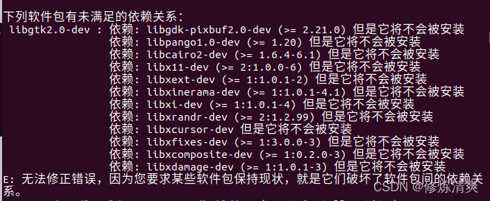

# Task02:使用 C++ 和 OpenCV 进行图像处理
## 配置C++与OpenCV历程
首先安装好gcc,g++等编译器，然后按任务书进行OpenCV的安装。然而，在`sudo apt install libopencv-dev`一步报错： 
 
向AI查询后，尝试其建议之一：手动安装OpenCV。参考这篇教程[Ubuntu 20.04搭建OpenCV 4.5.0 & C++环境](https://blog.csdn.net/weixin_44796670/article/details/115900538?spm=1001.2014.3001.5506)，并用文中方法测试，成功安装

然而，在用cmake编译程序时，终端报错“无法找到图像文件”，然而图像文件路径无误且完好无损。我又写了一份helloworld，发现可以被cmake编译运行。结合vscode中报错“无法打开源文件"opencv2/opencv.hpp"”，认为安装的opencv有问题，于是寻求解决办法。

向AI询问，未得到有效解决方案。在csdn上搜索该报错，尝试了这篇教程的解决办法([fatal error: opencv2/opencv.hpp: No such file or directory](https://blog.csdn.net/weixin_37950717/article/details/125221825))，但又出现`collect2: error: ld returned 1 exit status`的新报错。在csdn、AI、github上查询，无果。

网上给出的另一个解决方案是在c_cpp……文件中添加路径，但项目架构中无.vscode文件夹，因此不选择该方案。

这时，尝试AI给出的第二个解决方案：用aptitude命令安装libopencv-dev，这个命令在安装时有更强的灵活性。从这个方向搜索，在csdn上查到一篇相关教程[解决Linux安装libgtk2.0-dev显示依赖问题](https://blog.csdn.net/weixin_46107339/article/details/131686777?ops_request_misc=%257B%2522request%255Fid%2522%253A%2522A303C025-8FF8-48B9-95CE-2601592A8543%2522%252C%2522scm%2522%253A%252220140713.130102334.pc%255Fall.%2522%257D&request_id=A303C025-8FF8-48B9-95CE-2601592A8543&biz_id=0&utm_medium=distribute.pc_search_result.none-task-blog-2~all~first_rank_ecpm_v1~rank_v31_ecpm-1-131686777-null-null.142^v100^pc_search_result_base7&utm_term=libgtk2.0-dev%E6%97%A0%E6%B3%95%E5%AE%89%E8%A3%85%E7%9A%84%E8%A7%A3%E5%86%B3%E6%96%B9%E6%A1%88&spm=1018.2226.3001.4187)。虽然需要安装的库不同，但操作方法认为可以借鉴。

使用该方法安装libopencv-dev，成功。然后我想删除之前手动安装的OpenCV，根据AI教程进行删除后，发现cmake仍编译不了OpenCV程序，我认为是删除时出了问题，但查找解决方案又太过麻烦，于是选择相对简单的方法：重装

重装后，安装gcc,g++,vscode和前两个依赖库，`sudo aptitude install libopencv-dev`，按教程对其中部分内容进行降级操作，成功安装，且用cmake成功编译运行OpenCV函数，环境配置到此结束。
## 主程序开发
开发前跟AI要了一份简单程序，学习了图片的加载、展示与保存操作 
 
### 参考教程
大纲参考这篇文章：[基于C++ OpenCV的图像处理-基础篇](https://blog.csdn.net/Aden422413/article/details/137361030?spm=1001.2014.3001.5506)

灰度图与HSV图片转换参考这两篇文章完成： 
[C++：opencv将彩色图转换为灰度图](https://blog.csdn.net/Ethan_Rich/article/details/140434173?ops_request_misc=%257B%2522request%255Fid%2522%253A%25222D690658-BD51-4596-B798-8F069D143B0E%2522%252C%2522scm%2522%253A%252220140713.130102334.pc%255Fall.%2522%257D&request_id=2D690658-BD51-4596-B798-8F069D143B0E&biz_id=0&utm_medium=distribute.pc_search_result.none-task-blog-2~all~first_rank_ecpm_v1~rank_v31_ecpm-1-140434173-null-null.142^v100^pc_search_result_base7&utm_term=C%2B%2Bopencv%E5%9B%BE%E5%83%8F%E8%BD%AC%E6%8D%A2%E4%B8%BA%E7%81%B0%E5%BA%A6%E5%9B%BE&spm=1018.2226.3001.4187) 
[使用Opencv将RGB颜色空间转换到HSV颜色空间/灰度图](https://blog.csdn.net/bjbz_cxy/article/details/79710126)

提取图片红色区域的HSV方法：参考这篇教程[图像处理-提取指定颜色](https://blog.csdn.net/xdg15294969271/article/details/121642176?ops_request_misc=&request_id=&biz_id=102&utm_term=%E6%8F%90%E5%8F%96%E5%9B%BE%E7%89%87%E7%BA%A2%E8%89%B2%E9%A2%9C%E8%89%B2%E5%8C%BA%E5%9F%9F&utm_medium=distribute.pc_search_result.none-task-blog-2~all~sobaiduweb~default-1-121642176.142^v100^pc_search_result_base7&spm=1018.2226.3001.4187)完成 
### 其他操作
具体的代码实现与每一步的原理通过查询AI得到，无报错。如下图为学习均值滤波操作时与AI的对话

## 提交内容说明
resource中按任务书顺序给各操作展示的图片编号，图片名也能反映对应的操作